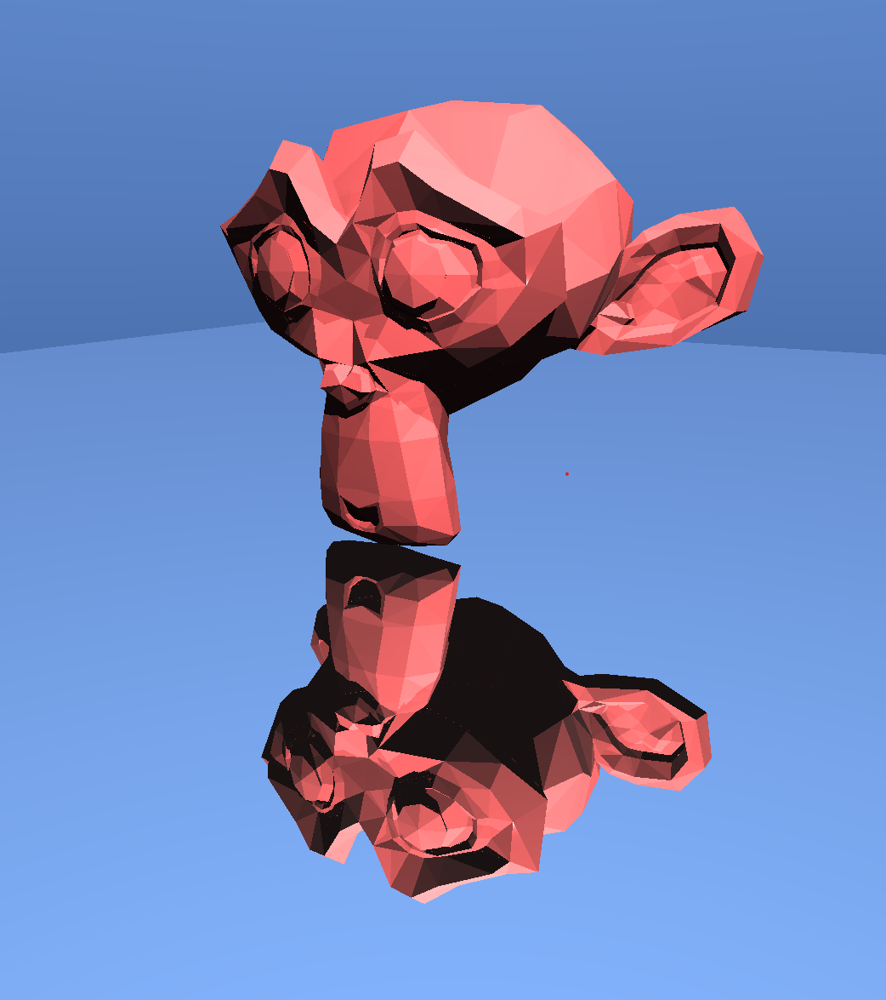

# RayZen

[](LICENSE)

RayZen is a modern, open-source GPU-accelerated path tracer written in C++ and OpenGL. It is designed for real-time physically-based rendering (PBR) of 3D scenes, supporting advanced features such as BVH acceleration, physically-based materials, and interactive camera controls. RayZen is ideal for graphics research, education, and as a foundation for your own renderer.




---

## Features

- **Real-Time Path Tracing**: Physically-based global illumination using GPU fragment shaders.
- **BVH Acceleration**: Fast ray traversal using a Bounding Volume Hierarchy for high performance.
- **Physically-Based Materials**: Support for metallic, dielectric, rough, and transparent materials.
- **Multiple Light Types**: Point and directional lights.
- **OBJ Mesh Loading**: Import and render standard OBJ meshes.
- **Interactive Camera**: WASD movement and mouse look.
- **Modular C++ Design**: Clean, extensible codebase.

---

## Getting Started

### Prerequisites
- C++17 compatible compiler
- OpenGL 4.3+
- CMake 3.10+
- [GLFW](https://www.glfw.org/), [GLEW](http://glew.sourceforge.net/), [GLM](https://glm.g-truc.net/), [Assimp](https://www.assimp.org/)

### Quick Install (Linux)
Run the provided script to install all dependencies:

```bash
bash install_requirements.sh
```

### Build Instructions

```bash
git clone https://github.com/PetoAdam/RayZen.git
cd RayZen/RayZen
mkdir build && cd build
cmake ..
make
./RayZen
```

### Controls
- **WASD**: Move camera
- **Mouse Drag (LMB)**: Rotate camera
- **ESC**: Exit

---

## Project Structure

- `src/` — C++ source files
- `include/` — C++ headers
- `shaders/` — GLSL shaders
- `meshes/` — Example OBJ meshes
- `docs/` — Documentation

---

## Documentation

- **User & Build Guide**: See this README.
- **Technical & Mathematical Details**: See [`docs/TECHNICAL_DETAILS.md`](docs/TECHNICAL_DETAILS.md) for an in-depth explanation of the rendering algorithms, BVH, and system architecture.

---

## Contributing

Contributions are welcome! Please open issues or pull requests for bug fixes, new features, or improvements.

---

## License

This project is licensed under the MIT License. See the [LICENSE](LICENSE) file for details.
